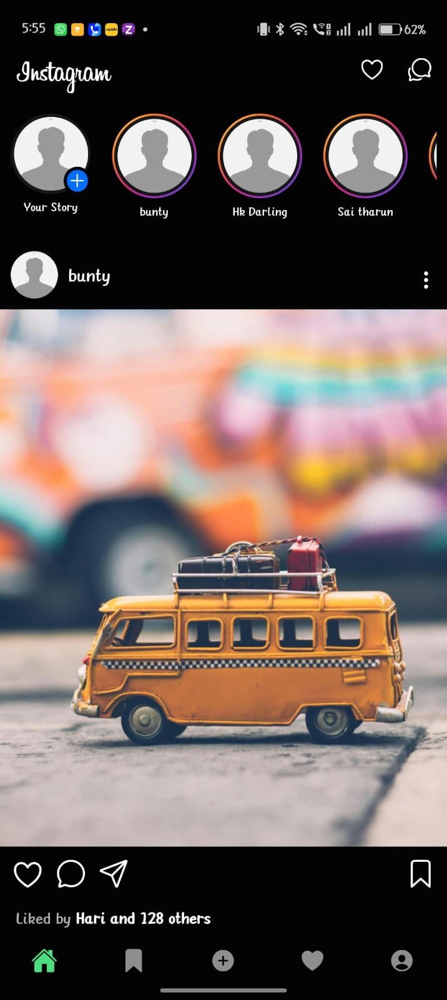
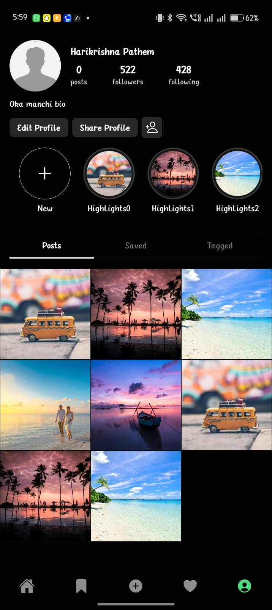
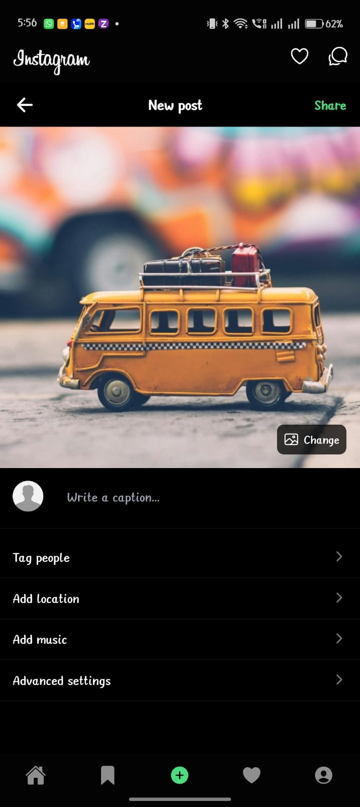
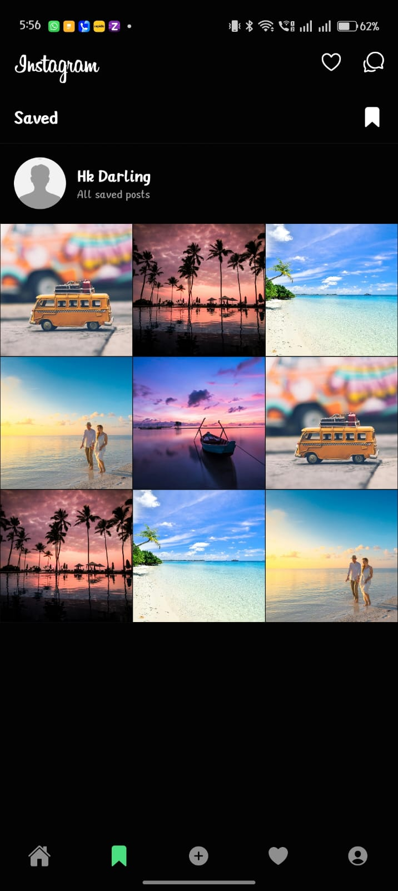
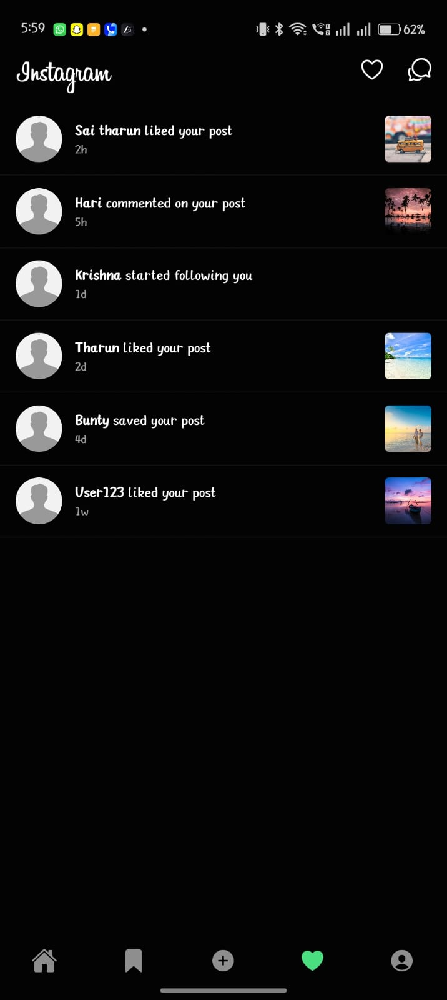

# 📸 React Native Instagram Clone

An Instagram-inspired mobile application built using **React Native**, **Expo**, and **Expo Router**.  
This project recreates the core Instagram UI experience including feeds, profile grid, bookmarks, create post flow, and notifications.

---

## ✨ Features

- 🏠 Home feed with stories & posts
- ➕ Create post with image picker & caption
- 🔖 Bookmarks (saved posts)
- 🔔 Notifications (Instagram-style)
- 👤 Profile page
  - User stats (posts, followers, following)
  - Highlights section
  - 3-column post grid (Instagram style)
  - Tabs for Posts / Saved / Tagged
- 🌙 Dark theme UI
- 📱 Expo Go compatible
- 🚫 No Reanimated / Worklets (stable setup)

---

## 🛠 Tech Stack

- React Native
- Expo
- Expo Router
- Expo Image Picker
- Ionicons
- FlatList & ScrollView
- JavaScript / TypeScript

---

## 📂 Project Structure

```txt
react-native-insta-clone/
│
├── app/
│   ├── (tabs)/
│   │   ├── index.tsx          # Home feed
│   │   ├── create.tsx         # Create post
│   │   ├── bookmarks.tsx      # Saved posts
│   │   ├── notifications.tsx  # Notifications
│   │   ├── profile.tsx        # Profile screen
│   │   └── _layout.tsx        # Bottom tab layout
│   │
│   └── _layout.tsx            # Root layout
│
├── components/
│   └── ProfileComponents/
│       └── HighLights.tsx
│
├── assets/
│   └── images/
│       ├── feed1.jpg
│       ├── feed2.jpg
│       ├── feed3.jpg
│       ├── feed4.jpg
│       ├── feed5.jpg
│       └── dummy-profile.jpg
│
├── styles/
├── constants/
└── README.md
```
## 📸 Screenshots

### 🏠 Home Feed



### 👤 Profile


### ➕ Create Post


### 🔖 Bookmarks


### 🔔 Notifications



## 🚀 Getting Started

### 1️⃣ Clone the repository

```bash
git clone https://github.com/Harikrishna-Pathem/react-native-insta-clone.git
cd react-native-insta-clone
```

### 2️⃣ Install Dependencies

```bash
npm install
```

### 3️⃣ Start The App

```bash
npx expo start
```


